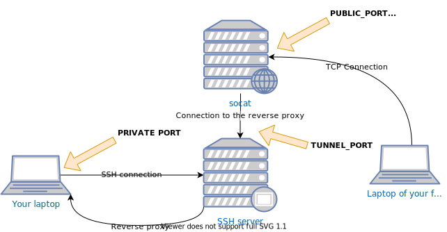

**Link to the project: [github.com/maxammann/ndove](https://github.com/maxammann/ndove)**

Sometimes you want to expose a port running on localhost to the internet. This can be challenging because of multiple reasons:

* Your internet provider does not provide you with a unique IPv4 address
* There is a firewall between you and the internet through which you can not poke holes
* You do not want to modify your system just to expose some port

There are commercial platforms which offer this as a service like [Ngrok](https://ngrok.com/). This
is easy to setup as a JavaScript developer but can be a hassle if you are not familiar with npm.
Also this solution falls short if you care about privacy.

This problem is not that complicated that it needs enterprise software. In fact you can do this with
common Unix tools. All you need is `ssh` on your client, `socat` and a server running a SSH server. This server should have a IPv4 address and ports should be accessible.

Out of this need for a simple solution I created a tool called [ndove](https://github.com/maxammann/ndove). To run this tool you just need a public server with SSH and socat installed.
Using the tool is quite simple:

```txt
$ ./ndove.sh max@example.com 8080 8080 123.123.123.123 ::1
Sucessfully forwarded local port
Binding 8123 to ip6:2a01:4f8:c2c:2fff::c1
Binding 8123 to ip4:78.47.200.189
```

There is a quite overview of the parameters:

|Parameter|Description|
|---|---|
|ssh-destination|SSH destination like user@host|
|private-port|Port on your development machine that you want to expose|
|public-port|Port at which you want to access your local post on the public server|
|public-ip4|The public IP where you want to have your local port exposed. Usually the same as the IP of the SSH server|
|public-ip6|Like `public-ip4` but for IPv6|

## Architecture

The architecture of the tool is quite simple:


<sup>`./ndove.sh max@example.com $PRIVATE_PORT $PUBLIC_PORT $PUBLIC_IP4 $PUBLIC_IP6`</sup>

Internally the tool uses a SSH reverse proxy.