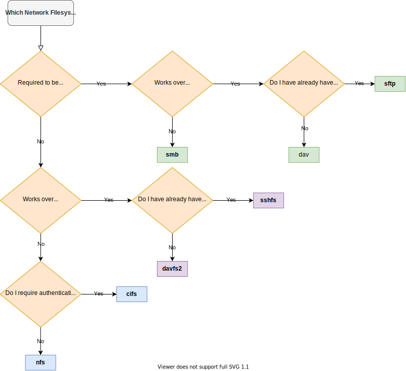

**TL;DR: [Just tell me what to use!](#when-to-use-what)**

Mounting file systems over a network can be very helpful. For example if you have a NAS (Network Attached Storage) and want to make the remote files available locally. That way applications running on a laptop can transparently access remote files.
There is no need for application level support. Files are made available locally that any program in the user space can interact with them. 

In this post I want to provide an overview of the client-side implementation available on Linux.
There are way to many, and every has advantages and disadvantages.
The table below should provide an overview of the implementations of network file systems which are covered in this comparison.

We will not discuss server-side implementations. Selecting a server-side implementation is usually very easy as there is not that much diversity.

|Implementation Name|Protocol|Interface|User space|References|Example Command|
|---|---|---|---|---|---|
|dav|WebDav|GVFS|Yes|[Source](https://github.com/GNOME/gvfs/blob/62600785e58732d7b2db4641ebe9d1c56bda6397/daemon/gvfsbackenddav.c)|`gio mount dav://...`|
|sftp|WebDav|GVFS|Yes|[Source](https://github.com/GNOME/gvfs/blob/62600785e58732d7b2db4641ebe9d1c56bda6397/daemon/gvfsbackendsftp.c)|`gio mount sftp://...`|
|smb|SMB|GVFS|Yes|[Source](https://github.com/GNOME/gvfs/blob/62600785e58732d7b2db4641ebe9d1c56bda6397/daemon/gvfsbackendsmb.c)|`gio mount smb://...`|
|cifs|CIFS/SMB|Kernel|No|[Source](https://github.com/torvalds/linux/tree/b5013d084e03e82ceeab4db8ae8ceeaebe76b0eb/fs/cifs)|`mount -t cifs ...`|
|nfs|NFS|Kernel|No|[Source](https://github.com/torvalds/linux/tree/b5013d084e03e82ceeab4db8ae8ceeaebe76b0eb/fs/nfs)|`mount -t nfs ...`|
|davfs2|WebDav|FUSE|Yes|[Source](https://git.savannah.nongnu.org/cgit/davfs2.git/?h=experimental)|`mount -t davfs ...`|
|sshfs|SSH|FUSE|Yes|[Source](https://github.com/libfuse/sshfs)|`sshfs ...`|

(Note: CIFS is a dialect of SMB which has been originally developed by Microsoft)

Here is the description for each column:

* **Implementation Name:** The name of the implementation which will be used throughout this post.
* **Protocol**: The protocol which is used for transferring and browsing files over the network.
* **Interface:** The interface column shows the major interface which is used for communication between the implementation and the kernel. GVFS is the Gnome Virtual File System and uses FUSE as interface to communicate with the kernel. I decided to highlight that an implementation uses GVFS instead of using FUSE directly. Introducing a layer between the implementation and FUSE has advantages and disadvantages.
* **User space:** Determines whether the implementation is running in the kernel space or user space.
* **References:** Links to further information like the source code of the implementation.
* **Example Command:** Hint on how to mount a network file system.

## Comparison Criteria

* **C1: Performance (Latency & Bandwidth).**
  When browsing files in a network file system, latency is important. Also, when reading many small files latency is key. You do not want to wait a long time before file transfers are starting.

  When transferring large files, bandwidth is key. Bandwidth is measured in bytes per second. For example when transferring a large backup (tar.gz) from a network file system to your local ext4 file system latency is not that important. A high bandwidth is important in this case.
* **C2: Works over Wide Area Networks (WANs).**
  The connection over which network file systems are mounted can be unreliable. For this reason we have the notion of two network classes: LAN and WAN. LAN is usually the network in your home. An WAN network is the internet. A VPN network would also be a WAN because it uses the internet as transport. 
  
  Connections within a LAN have low latency and high bandwidth. 
  
  WANs have a significantly worse latency. For example the ICMP/`ping` latency in my home network is 1-3ms depending on whether WLAN is used or not. The latency to a random server on the internet ranges from 6-60ms.
  The bandwidth of a WAN can be in a similar scale as a LAN. A speed of 1GBit/s is not that uncommon. In a nutshell high latency is of more concern compared to bandwidth.
* **C3: Tolerance against Network Connection Loss.**
  If you plan to mount network shares on your laptop which is connected over WLAN, then a tolerance against network issues is beneficial. Ideally, you would expect a network file system to reconnect automatically. Maybe the file system can also cache changes to the file system if you happened to be disconnected from your network for a short period of time.

* **C4: Support for Advanced File System Features.**
  Naively one would think that the only actions a file system would need are: Directory List, Create, Delete, Open, Write, Append, Read and Close. In fact, these are by far the most used ones. But there are also others which applications might require in order to work properly. There is for example the [fallocate](https://man7.org/linux/man-pages/man2/fallocate.2.html) system call which creates an empty file or arbitrary size instantly. There is also [flock](https://man7.org/linux/man-pages/man2/flock.2.html) which is able to lock files.

    Those features are not supported on every file system - especially not on network file systems.
* **C5: Encryption**. The transport should of files over the network should be encrypted. While traffic should be encrypted in LANs and WANs, encryption in WANs is essential.

## Overview of Criteria

The following table summarizes at which criteria each implementation stands out.

|  | dav | sftp | smb | cifs | nfs | davfs2 | sshfs |
|---|:---:|:---:|:---:|:---:|:---:|:---:|:---:|
| C1: Performance |  |  |  | :white_check_mark: (Over LAN) | :white_check_mark: (Over LAN)| :white_check_mark: | :white_check_mark: |
| C2: WAN | :white_check_mark: | :white_check_mark: |  |  |  | :white_check_mark: | :white_check_mark: |
| C3: Tolerance | :white_check_mark: | :white_check_mark: | :white_check_mark: |  |  |  |  |
| C4: Support |  |  |  | :white_check_mark: | :white_check_mark: |  |  |
| C5: Encryption | :white_check_mark: | :white_check_mark: |  |  |  | :white_check_mark: | :white_check_mark: |

## Evaluation of Implementations

I will now provide a reasoning for the overview table shown above.

In the following I will group the implementations according to their **Interface** like shown in the first table. The reason for this is that the way they are communicating with the rest of the system is their major difference between each other.

### **GVFS:** `dav`, `sftp` and `smb`
  
Protocols implemented in GVFS work especially well over unreliable networks. The implementations for WebDav, sFTP and SMB are part of a single daemon which runs in the background while network file systems are mounted. 
This means data which you write to the network file system has to pass from the implementation, through `gvsfs`, reaches then the `FUSE` system interface and then interacts with the Linux kernel.

It seems like a main focus of these implementations has been to be appropriate for the Linux desktop. There are for example integrations with file managers like PCManFM or Dolphine. 

  * **Advantages.** A major benefit is that if your laptop for example looses network connectivity, then your system will not freeze. This is common for network file systems implemented in the kernel like `cifs` or `nfs`. It is also always possible to unmount a GVFS mounted network file system, even if the connected server is long gone and disconnected.

  * **Disadvantages.** A disadvantage is that the performance in terms of latency and bandwidth of `dav`, `sftp` and `smb` is worse than that of their opponents `davfs2`, `sshfs` and `cifs`.

    `smb` should not be used over WAN or VPN networks because low latency is very important for the SMB/CIFS protocol. From my experience browsing a `smb` file system over a WAN significantly reduces its responsivity. 
  * **Encryption.** The encryption of `dav` and `sftp` is designed to be used over the internet. When using `smb`, the connection should be tunneled over a VPN.

### **Kernel:** `cifs` and `nfs`
  These two implementation reside in the Linux kernel source tree. This means they come with Linux. Except some user space tooling nothing has to be installed. Both can be configured easily through `/etc/fstab`.

  * **Advantages.** `cifs` and `nfs` offer the best performance in terms of throughput and latency if used over a LAN. 
  
    Furthermore, both offer support for advanced file system features. It is for example possible to use `fallocate` with `nfs`.

  * **Disadvantages.** `cifs` and `nfs` should not be used over WAN or VPN networks because low latency is very important for the SMB/CIFS protocol. From my experience browsing a `cifs` or `nfs` file system over a WAN significantly reduces its responsivity.

    A further disadvantage is that the system can freeze if the connection to the server is lost. It is also not easily possible to unmount a `cifs` or `nfs` file system if the connection to the server has been lost.

  * **Encryption.**  Both should only be used over an encrypted VPN if used over an untrusted WAN. The NFS protocol does not offer any encryption. The CIFS protocol does offer encryption, but its not as trustworthy and bulletproof as for example TLS which has been designed for the public internet.

### **FUSE:** `davfs2` and `sshfs`
  These two implementations fill an interesting niche. They offer a secure and and reliable transport over the internet, while offering decent performance.

  * **Advantages.** `davfs2` and `sshfs` are a performant in terms of latency and bandwidth. They also offer settings for client side caches. This means even over low latency WAN networks high throughput can be achieved.

  * **Disadvantages.** Like the in-kernel implementations `cifs` and `nfs`, `davfs2` and `sshfs` can freeze the system. To my knowledge their support for advanced file system features is not as comprehensive as from `cifs` and `nfs`.

  * **Encryption.** The encryption of `davfs2` and `sshfs` is designed to be used over the internet.

## When to Use What?

**The network connection is unreliable. Performance is not the main concern.**

You can also use `smb` if connected over LAN.
Use `dav` or `sftp` if connected over WAN or VPN. 
Use what ever is easier. If you have already an SSH server running and have proper access to it then you can choose `ssfs`. If you have a nginx server running, you can use `davfs2`.

> Example Situation: You are traveling by train. You are connected to your home NAS via a VPN and stream low resolution family videos.

**The network connection is stable, but has high latency. I'm mounting the network file system over a WAN or VPN.**

Use `davfs2` or `sshfs`. If you are unsure which to choose, see the answer to the question before this one.

> Example Situation: You mount a network file system on a VM in the cloud. The file system is located on a NAS in your home.

**The network connection is 100% stable. I want to mount a network file system which is in the same LAN or even on the same physical computer.**

Use `cifs` or `nfs`. They especially shine when used over an in-house LAN where transport encryption is not required. Choose whatever is easier in your current situation. If you want user authentication with NFS you probably need a Kerberos infrastructure which is maybe too complex for your use case.

> Example Situation: You are at home where you also have a NAS. You are connected to the NAS via LAN or WLAN. You mount a network file system to your laptop.

> Example Situation: You operate a hypervisor with many VMs. You create a network mount between VMs.

## Flow Chart for Deciding

The flowchart below should help to select an appropriate implementation. Uses implementation names from the first table.

