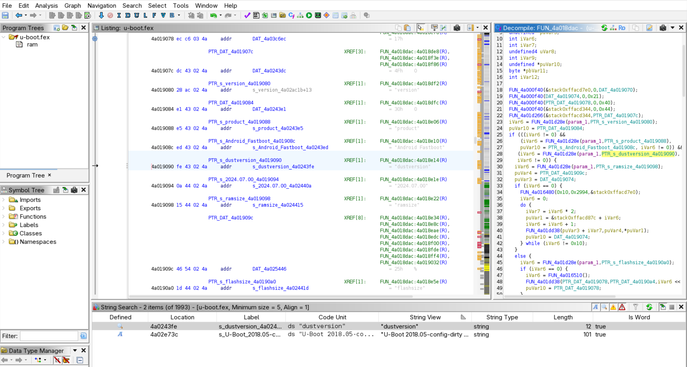
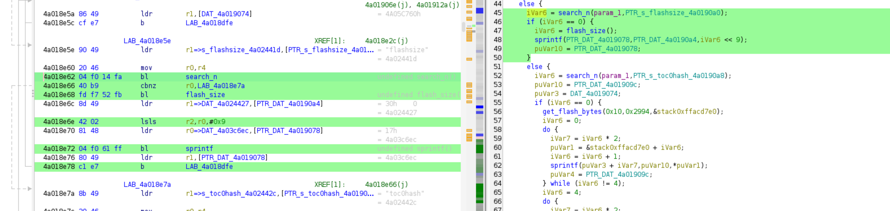

<!-- Motivation -->

I got myself a Dreame vaccum robot with the goal of -- cleaning. Yes, I did not have the goal originally to root my vacuum.
Howenver, in case I ever want to sideload software onto by vacuum I picked a robot that seemed easily rootable.
The Dreame X40 looked decent and Dennis Giese did awesome work on getting root access to it [back in 2021](https://dontvacuum.me/talks/DEFCON29/DEFCON29-vacuum-robots.pdf).

Even though the process is [clearly written up in a PDF](https://builder.dontvacuum.me/nextgen/dreame_gen3.pdf) I had some open questions:

1. How does the rooting method work? Which security measures are circumvented?
2. The PDF mentioned that calibration data and device ID is lost. Why is that? Can I do a backup before rooting?
3. Can I do a full flash backup so reverting is possible?
4. What are the `dustx100.bin` files? Are those the flash dumps I'm looking for?
5. The Fastboot mode looks a bit odd. How is it related to Fastboot on Android?
6. Where do the binaries used during rooting come from? Who created them?

This blog post is answering these questions.

**My main motivation here is to learn about how the Dreame X40 works and prepare for some deeper security audit.**

I want to avoid loosing any data/features when rooting it. The first step  is to gain root access. After that topics like cloud connectivity, or the MCU etc. can be vetted. If for instance the device ID is lost I would have little hope of analyzing the connectivity deeper.

## FEL rooting method explained

Ideally, first read the PDF as it goes into full detail. In summar the rooting method follows these steps:

1. Make your Laptop listen for FEL devices and connect the robot via USB.
2. Boot the Dreame robot into FEL mode by grounding `BOOT_SEL` while booting the robot.
3. Write a U-Boot image to memory and start it. In the PDF this is done using [Phoenixsuit on Windows](https://androidmtk.com/download-phoenixsuit) and [LiveSuit on Debian](https://github.com/linux-sunxi/sunxi-livesuite) (⚠️ Download at your own risk. These are random binaries off the Internet!)
4. The U-Boot image launches into [Fastboot mode](https://docs.u-boot.org/en/stable/android/fastboot-protocol.html). U-Boot is using the fastboot protocol, but this does not mean that all commands are available or the OEM implemented custom ones.
5. Now we flash the `toc1`, `boot1`, `boot2`, `rootfs1` and `rootfs2` partitions. The update to `toc1` disables secure boot. However I have not verified how it does that.


The linked FEL images in the PDF contain an U-Boot version with custom fastboot commands. Here is an overview of the fuctionality.

| Command | Description |
| ---| ---|
| `fastboot getvar config` | You have to call this before other commands. Prints a MD5 hash for identification. |
| `fastboot getvar product` | Returns "Android Fastboot" |
| `fastboot getvar dustversion` | A hardcoded string returning the version of the FEL image. |
| `fastboot getvar ramsize` | The size of the ram. |
| `fastboot getvar flashsize` | The size of the flash. |
| `fastboot getvar toc0hash` |  MD5 hash of the toc0 partition. |
| `fastboot getvar toc1hash` | MD5 hash of the toc1 partition. |
| `fastboot getvar toc1version` | Unknown. |
| `fastboot getvar minicg` | Unknown. |
| `fastboot oem dunst` | Initializes the rooting procedure. I don't know yet if this does anything. |
| `fastboot oem reset` | Sets CHUNK=0. This defines which part of the flash storage should be copied when `get_staged` is invoked. |
| `fastboot oem stage1` | Sets CHUNK=1 |
| `fastboot oem stage2` | Sets CHUNK=2 |
| `fastboot get_staged dust.bin` | Downloads flash data to the file `dust.bin`. This data is encrypted (more on this later). |
| `fastboot oem prem` | Not sure yet what this does. |
| `fastboot flash <part> <file>` | Flashes a partition (e.g., rootfs, boot) with the specified image file. |

## Flash dump

To preserve as much data from the "non-rooted" state I was really after a flash dump. 
I wondered if the rooting method gives me some hints on how I could dump the flash.
The FEL mode is the debugging feature used in the above rooting method. According to [this blog post](https://xor.co.za/post/2018-12-01-fel-bootprocess/) FEL allows you to write to memory and execute it. Actually, the blog post gives some insights on what is likely happening when using LiveSuit/Phoenixsuit. It just "boot" from an in-memory u-boot image.

FEL does not give access to the flash, but it allows you to execute arbitrary code with quite a high priviledge. Binaries executed in its context have access to the flash which is what I'm looking for.

Now, the the dumps you can crab using `get_staged` caught my attention. They are in total ~1200MB which seemed too large for a memory dump. Also which memory would you copy? Likely the memory would not contain any meaninful data just after boot.

So the suspicion is that those are actual flash dumps. Executing `binwalk` on them contradics this idea though. Their entropy is high throughout the file. 



This suggests the dumps are encrypted. This striked me as pretty weird. Why would they be encrypted? Unfotunately. I did not yet find out.
Let's continue though as it turns out its pretty easy to decrypt them.


## Unpacking a FEL image

I reproduced entering fastboot on Windows aswell.
This was mostly to sanity check my understanding in the beginning when I barely understood anything about FEL yet.

The tool [imgRePacker](https://xdaforums.com/t/tool-imgrepacker-livesuits-phoenixsuits-firmware-images-unpacker-packer.1753473/) is capable on unpacking FEL images like the one you can download from [builder.dontvacuum.me/nextgen](https://builder.dontvacuum.me/nextgen/). There are also similar images provided in the downloads from [builder.dontvacuum.me/_dreame_r2416](https://builder.dontvacuum.me/_dreame_r2416.html) but I have not yet diffed them.

The unpacked image looks like this:

```txt
[4.0K]  dust-livesuit-mr813-ddr4.img.dump
├── [   6]  arisc.fex
├── [149K]  aultls32.fex
├── [163K]  aultools.fex
├── [1.0K]  board.fex
├── [1.7K]  cardscript.fex
├── [ 72K]  cardtool.fex
├── [ 19K]  config.fex
├── [ 16K]  dlinfo.fex
├── [128K]  env.fex
├── [ 44K]  fes1.fex
├── [2.3K]  image.cfg
├── [4.0K]  _iso
├── [ 512]  split_xxxx.fex
├── [109K]  sunxi.fex
├── [8.0K]  sunxi_gpt.fex
├── [ 12K]  sys_config.fex
├── [ 165]  sys_partition.fex
├── [ 98K]  toc0.fex
├── [ 99K]  toc0.fex.png
├── [1.1M]  toc1.fex
├── [226K]  toc1.fex.png
├── [245K]  u-boot.fex
├── [113K]  u-boot.fex.png
├── [180K]  usbtool.fex
├── [   4]  Venv.fex
└── [   8]  vmlinux.fex
```
The most interesting code is likely in one of the larger binaries. So that would be either `toc0.fex`, `toc1.fex` or `u-boot.fex`. As we saw some custom Fastboot commands which are implemented in U-Boot I first took a look at that.

## Reversing u-boot

I started by loading u-boot.fex into Ghidra. 



Initially, I left the base address at 0 and then quickly figured out that the base address is `0x4a000000`. This is the address where u-boot expecs to be loaded into memory.

From there I looked for strings containing "dust" and quickly found the Fastboot handling code.



From there I started reverse engineering the first Fastboot commands like `getvar`. I also found some weird Fastboot OEM commands that I did not yet investigate like `bko`, `upload`, `bypass`, `debug` or a command starting with `fan` and ending in `pi`.

Within the `getvar` function I found that you can return the flash size.
Now likely the same code calculating the size of the flash is also used to dump it.



Bingo! There is only one reference to the function `flash_size`.

> Note: When reversing its often really nice to have some reference function like the `sprintf` function above. So investing time into identifying the generic and simple ones is well spent time. I also used these [U-Boot sources](https://github.com/jcyfkimi/tina-u-boot-2018/blob/38c0fca43ad69b48e5382ed6ec4df8b7ffc375be/drivers/sunxi_usb/usb_fastboot.c#L1928) and diffed the code with the decompiled one to identify functions. 

At `0x4a01918c` we find the function `upload` that gets data from the flash and puts it into a buffer which will be transmitted over USB using the Fastboot protocol.

Intersting observations are that it copies 0x40000 bytes which are the 400MB we saw earlier. `CURRENT_STAGE` is either 0/1/2. It is controlled by the Fastboot commands `oem reset`, `oem stage1` and `oem stage2`. Based on this value either flash memory from the beginning or a certain offset is taken.

Note that this upload function uses the Fastboot protocol. This is why it is stargint by sending a string like "DATA: %08x" as defined in the Fastboot documentation:

> DATA -> the requested command is ready for the data phase. A DATA response packet will be 12 bytes long, in the form of DATA00000000 where the 8 digit hexidecimal number represents the total data size to transfer.

We can also see some light XOR encryption here within the most inner do-while loop.
The encryption key is taken from `xorTableAddress`. The data for the key is at `0x4a03c760`. Initially, I thought the key would be just in the binary. However, the key is 0x200 * 0xFF bytes long.
This is because each chunk is 0x200 bytes long and we take the last byte from the blockIndex to address the byte in the key.
We would reach end-of-file before being able to read the whole key from the binary alone.

```c

void upload(void)

{
  uint currentFlashBatchsize;
  undefined4 len;
  int byteIndex;
  uint uploadBlockStart;
  uint uploadBlockEnd;
  uint blockSize;
  uint blockIndex;
  uint 0x40000-1;
  int xorTableAddress;
  
  0x40000-1 = value3FFFFF;
  currentFlashBatchsize = flash_size();
  hash_init(&stack0xf7fffd88);
  xorTableAddress = xortable;
  hash_md5(&stack0xf7fffd88,currentFlashBatchsize,4);
  MD5Final(DAT_4a019270,&stack0xf7fffd88);
  if (DAT_4a019274 < currentFlashBatchsize << 9) {
    currentFlashBatchsize = value7800;
  }
  sprintf(&stack0xf7fffd44,str_DATA%x,currentFlashBatchsize << 9);
  len = str_len(&stack0xf7fffd44);
  stage(&stack0xf7fffd44,len);
  uploadBlockStart = currentFlashBatchsize * *CURRENT_STAGE;
  uploadBlockEnd = uploadBlockStart + currentFlashBatchsize;
  for (; uploadBlockStart < uploadBlockEnd; uploadBlockStart = uploadBlockStart + 0x40000) {
    blockSize = currentFlashBatchsize;
    if (0x40000-1 < currentFlashBatchsize) {
      blockSize = 0x40000;
    }
    blockIndex = 0;
    get_flash_bytes(uploadBlockStart,0x40000,&stack0xf7ffffe0);
    do {
      memcpy(&stack0xf7fffde0,&stack0xf7ffffe0 + blockIndex * 0x200,0x200);
      byteIndex = 0;
      do {
        (&stack0xf7fffde0)[byteIndex] =
             *(byte *)(xorTableAddress + (blockIndex & 0xff) * 0x200 + byteIndex) ^
             (&stack0xf7fffde0)[byteIndex];
        byteIndex = byteIndex + 1;
      } while (byteIndex != 0x200);
      blockIndex = blockIndex + 1;
      stage();
    } while (blockSize != blockIndex);
    currentFlashBatchsize = currentFlashBatchsize - 0x40000;
  }
  str_fn1(&stack0xf7fffd44,OKAY);
  len = str_len(&stack0xf7fffd44);
  stage(&stack0xf7fffd44,len);
  return;
}
```

This means the key is calculated dynamically during runtime. Following the references from the XOR table we reach a function at `0x4a01956c` which I called `generate_xor_table`. This function is probably statically at some point before you can dump the memory.

This function generates the key by starting from the seed `0xc9acbcc6` and iteratively generate the key.

```c
int generate_xor_table(void)

{
  int iVar1;
  undefined4 *puVar2;
  int index;
  undefined1 ctx [88];
  undefined1 ctx1 [92];
  int table;
  
  table = ptr_xortable;
  index = 0;
  hash_init(ctx);
  hash_md5(ctx,table_start_Hash_c9_AC_BC_C6,4);
  MD5Final(ptr_xortable,ctx);
  do {
    hash_init(ctx1);
    hash_md5(ctx1,ptr_xortable,0x20000);
    iVar1 = index * 0x10;
    index = index + 1;
    MD5Final(table + iVar1,ctx1);
    puVar2 = DAT_4a01960c;
  } while (index != 0x2000);
  memset(DAT_4a01960c,0,0x1c);
  *DAT_4a019610 = 0;
  *(undefined4 *)PTR_DAT_4a019614 = 0;
  *(undefined4 *)PTR_DAT_4a019618 = 0;
  *puVar2 = 0x41000000;
  table = maybe_malloc(0x10000);
  puVar2[4] = table;
  if (table == 0) {
    maybe_free(*puVar2);
    table = -1;
  }
  else {
    table = env_get(ptr_str_serial_number);
    if (table != 0) {
      maybe_str_cpy(*(undefined4 *)(ptr_maybe_Android_Fastboot + 8),table,0x18);
      table = 0;
    }
  }
  return table;
}
```

It's 2025 and we got LLMs so it would be a waste of time to translate this code to e.g. Python.
The resulting key is independant of any serial number so the key should work for any flash dumps.

## Summary of reversing U-Boot

By reversing the U-Boot I was able to find some non-public functionality.
The `generate_xor_table` can be used to generate an XOR key. By inverting the `upload` function flash dumps can be decrypted now.


## Option Questions

There is some functionality I do not yet understand (e.g. `oem dunst` and `oem prep`), but likely its also not relevant for my goal which is observing what the Draeme robot is doing during normal operation to discover security flaws.

Also I'm very unsure why the flash dumps are encrypted.
This creates a dependence to the author of the rooting method. If you brick your device you need help by them. If you would just have the flash dump then I would assume reverting your robot should "just work".

I also wondered why the flash dump is only 1200MB while the whole flash is 4GB of the Dreame X40. The most important partitions are in the first 500MB as this partition layout shows:

```text
GPT fdisk (gdisk) version 1.0.10

Partition table scan:
  MBR: protective
  BSD: not present
  APM: not present
  GPT: present

Found valid GPT with protective MBR; using GPT.

Command (? for help): p
Disk mmcblk0.img: 7634944 sectors, 3.6 GiB
Sector size (logical): 512 bytes
Disk identifier (GUID): AB6F3888-569A-4926-9668-80941DCB40BC
Partition table holds up to 12 entries
Main partition table begins at sector 2 and ends at sector 4
First usable sector is 41984, last usable sector is 7634910
Partitions will be aligned on 512-sector boundaries
Total free space is 0 sectors (0 bytes)

Number  Start (sector)    End (sector)  Size       Code  Name
   1           41984           42495   256.0 KiB   0700  boot-resource
   2           42496           43519   512.0 KiB   0700  env
   3           43520           44543   512.0 KiB   0700  env-redund
   4           44544          105983   30.0 MiB    0700  boot1
   5          105984          515583   200.0 MiB   0700  rootfs1
   6          515584          577023   30.0 MiB    0700  boot2
   7          577024          986623   200.0 MiB   0700  rootfs2
   8          986624          987647   512.0 KiB   0700  private
   9          987648          995839   4.0 MiB     0700  misc
  10          995840          996863   512.0 KiB   0700  record
  11          996864          997887   512.0 KiB   0700  pstore
  12          997888         7634910   3.2 GiB     0700  UDISK
```

I believe the choice of 1200MB is to limit the amount images that might be included in the flash dump. However, In my dump I could find hundreds of pictures of my flat. The robot likely deleted them but did not yet overwrite them.

Therefore, hackers who want to root their Dreames should store their `dustx100.bin`, `dustx101.bin` and `dustx102.bin` files in a save and also secure place.

Anyways, I'm super happy now that I can continue working on this robot and analyzing kernel & userspace.


##### Links

- Open source FEL tool: https://linux-sunxi.org/Sunxi-tools
- Information about FEL images: https://linux-sunxi.org/LiveSuit_images
